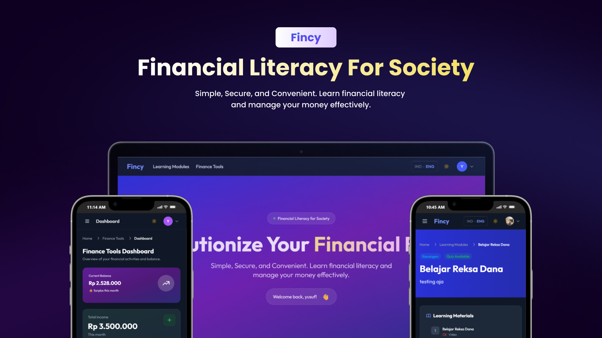

# 💰 Fincy - Financial Literacy for Society

<div align="center">



**Empowering everyone with financial knowledge and tools**

[](https://laravel.com)
[](https://reactjs.org)
[](https://vitejs.dev)
[](https://tailwindcss.com)
[](https://mysql.com)

</div>

## 📖 About

**Fincy** is a comprehensive web application designed to promote financial literacy through interactive learning modules and practical finance management tools. The platform enables users to learn financial concepts, take quizzes, earn certificates, and manage their personal finances effectively.

### 🎯 Mission

To make financial education accessible to everyone, empowering individuals with the knowledge and tools needed to make informed financial decisions.

## ✨ Features

### 📚 Learning Modules
- **Interactive Content**: Browse and access various financial literacy modules
- **Multimedia Learning**: Videos and text-based content for comprehensive understanding
- **Progress Tracking**: Monitor your learning progress across all modules
- **Quiz System**: Test your knowledge with 20-question quizzes
- **Digital Certificates**: Earn certificates upon successful quiz completion (70% passing score)
- **Public Certificate Sharing**: Share your achievements with public certificate links
- **Module Ratings**: Rate and review modules to help others
- **Bookmarks**: Save favorite modules for later

### 💼 Finance Tools
- **Transaction Management**: Track income and expenses with detailed categorization
- **Budget Planning**: Create and manage budgets for different categories
- **Financial Reports**: Visualize your financial data with charts and analytics
- **Category Management**: Organize transactions with custom categories
- **Subscription System**: Voluntary subscription with payment proof upload
- **Admin Approval**: Secure payment verification system

### 👥 User Roles
- **Regular Users**: Access learning modules and finance tools
- **Educators**: Contribute to creating modules and materials, manage ratings
- **Super Admins**: Full system access including user management, payments, and content management

### 🎨 User Experience
- **Dark Mode Support**: Comfortable viewing in any lighting condition
- **Bilingual Interface**: Indonesian and English language support
- **Responsive Design**: Optimized for desktop, tablet, and mobile devices
- **Modern UI/UX**: Clean, intuitive interface with smooth animations

### 🔐 Security & Authentication
- **Laravel Sanctum**: Secure API authentication
- **Role-Based Access Control**: Different permissions for different user roles
- **Protected Routes**: Secure frontend and backend route protection

## 🛠️ Tech Stack

### Backend
- **Framework**: Laravel 11
- **Authentication**: Laravel Sanctum
- **Database**: MySQL 8.0
- **File Storage**: Laravel Storage (local/public)
- **API**: RESTful API

### Frontend
- **Framework**: React 18
- **Build Tool**: Vite 5
- **Routing**: React Router DOM 6
- **Styling**: Tailwind CSS 3
- **State Management**: React Context API
- **HTTP Client**: Axios
- **Charts**: Recharts
- **Rich Text Editor**: React Quill
- **PDF Generation**: html2pdf.js
- **Drag & Drop**: @dnd-kit

## 📋 Prerequisites

Before you begin, ensure you have the following installed:
- **PHP** >= 8.2
- **Composer** >= 2.0
- **Node.js** >= 18.0
- **npm** >= 9.0
- **MySQL** >= 8.0
- **Git**

## 🚀 Installation

### 1. Clone the Repository

```bash
git clone https://github.com/yourusername/fincy-app.git
cd fincy-app
```

### 2. Backend Setup

```bash
# Navigate to backend directory
cd backend

# Install PHP dependencies
composer install

# Copy environment file
cp .env.example .env

# Generate application key
php artisan key:generate

# Configure database in .env file
# Edit .env and set your database credentials:
# DB_CONNECTION=mysql
# DB_HOST=127.0.0.1
# DB_PORT=3306
# DB_DATABASE=fincy
# DB_USERNAME=root
# DB_PASSWORD=your_password

# Run migrations
php artisan migrate

# Seed database with initial data
php artisan db:seed --class=SuperAdminSeeder
php artisan db:seed --class=EducatorSeeder
php artisan db:seed --class=DefaultCategoriesSeeder

# Create storage link for file uploads
php artisan storage:link

# Start Laravel development server
php artisan serve
```

Backend will run at `http://localhost:8000`

**Default Admin Credentials:**
- Email: `admin@fincy.com`
- Password: `admin123`

**Default Educator Credentials:**
- Email: `educator@fincy.com`
- Password: `educator123`

### 3. Frontend Setup

```bash
# Navigate to frontend directory (from project root)
cd frontend

# Install Node dependencies
npm install

# Create .env file (if needed)
# VITE_API_URL=http://localhost:8000/api

# Start development server
npm run dev
```

Frontend will run at `http://localhost:5173`

### 4. Build for Production

```bash
# Frontend production build
cd frontend
npm run build

# Backend optimization
cd backend
php artisan config:cache
php artisan route:cache
php artisan view:cache
```

## 📁 Project Structure

```
fincy-app/
├── backend/                 # Laravel API Backend
│   ├── app/
│   │   ├── Http/
│   │   │   ├── Controllers/
│   │   │   │   └── Api/     # API Controllers
│   │   │   └── Middleware/  # Custom Middleware
│   │   └── Models/          # Eloquent Models
│   ├── database/
│   │   ├── migrations/      # Database Migrations
│   │   └── seeders/        # Database Seeders
│   ├── routes/
│   │   └── api.php         # API Routes
│   └── storage/            # File Storage
│
└── frontend/                # React Frontend
    ├── src/
    │   ├── components/     # Reusable Components
    │   ├── contexts/       # React Context Providers
    │   ├── hooks/          # Custom Hooks
    │   ├── layout/          # Layout Components
    │   ├── pages/           # Page Components
    │   ├── services/        # API Services
    │   └── utils/           # Utility Functions
    ├── public/              # Static Assets
    └── dist/                # Production Build
```

## 🔌 API Endpoints

### Authentication
- `POST /api/register` - Register new user
- `POST /api/login` - Login user
- `POST /api/logout` - Logout user
- `GET /api/user` - Get authenticated user

### Learning Modules
- `GET /api/modules` - Get all active modules
- `GET /api/modules/{id}` - Get module details
- `GET /api/modules/{id}/quiz` - Get quiz questions
- `POST /api/modules/{id}/quiz/submit` - Submit quiz answers
- `GET /api/modules/{id}/certificate` - Get certificate
- `GET /api/modules/{id}/certificate/public/{token}` - Get public certificate
- `POST /api/modules/{id}/bookmark` - Bookmark/unbookmark module
- `POST /api/modules/{id}/rating` - Rate module

### Finance Tools
- `GET /api/finance-tools/status` - Check subscription status
- `POST /api/finance-tools/subscribe` - Upload payment proof
- `GET /api/finance-tools/dashboard` - Get dashboard data
- `GET /api/finance-tools/transactions` - Get transactions
- `POST /api/finance-tools/transactions` - Create transaction
- `PUT /api/finance-tools/transactions/{id}` - Update transaction
- `DELETE /api/finance-tools/transactions/{id}` - Delete transaction
- `GET /api/finance-tools/budgets` - Get budgets
- `POST /api/finance-tools/budgets` - Create budget
- `PUT /api/finance-tools/budgets/{id}` - Update budget
- `DELETE /api/finance-tools/budgets/{id}` - Delete budget
- `GET /api/finance-tools/categories` - Get categories

### User Profile
- `GET /api/profile` - Get user profile
- `PUT /api/profile` - Update profile
- `POST /api/profile/photo` - Upload profile photo
- `GET /api/profile/{slug}` - Get public profile

### Admin Endpoints
- `GET /api/admin/modules` - Get all modules (admin)
- `POST /api/admin/modules` - Create module
- `PUT /api/admin/modules/{id}` - Update module
- `DELETE /api/admin/modules/{id}` - Delete module
- `PUT /api/admin/modules/{id}/contents` - Update module contents
- `PUT /api/admin/modules/{id}/quiz` - Update quiz
- `GET /api/admin/payments` - Get all payments
- `PUT /api/admin/payments/{id}/approve` - Approve payment
- `PUT /api/admin/payments/{id}/reject` - Reject payment
- `GET /api/admin/users` - Get all users
- `PUT /api/admin/users/{id}/role` - Update user role
- `GET /api/admin/dashboard` - Get admin dashboard data
- `GET /api/admin/ratings` - Get recent ratings
- `DELETE /api/admin/modules/{moduleId}/ratings/{ratingId}` - Delete rating

## 🗄️ Database Schema

### Core Tables
- **users** - User accounts (super_admin, educator, user)
- **modules** - Learning modules
- **module_contents** - Module content (video/text)
- **module_progress** - User progress tracking
- **module_ratings** - Module ratings and reviews
- **module_bookmarks** - User bookmarks

### Quiz & Certificates
- **quizzes** - Quiz definitions
- **quiz_questions** - Quiz questions
- **quiz_attempts** - User quiz attempts
- **quiz_answers** - Quiz answers
- **certificates** - Digital certificates with public sharing

### Finance Tools
- **subscriptions** - Finance tools subscriptions
- **transactions** - Income and expense transactions
- **categories** - Transaction categories
- **budgets** - Budget plans

## 🎨 Key Features in Detail

### Certificate System
- Automatic certificate generation upon quiz completion (70% passing score)
- Public certificate sharing with unique tokens
- Customizable PDF file names
- Profile portfolio integration

### Finance Tools Dashboard
- Real-time income vs expense tracking
- Category-based expense analysis
- Budget monitoring and alerts
- Monthly and yearly financial reports
- Interactive charts and visualizations

### Admin Dashboard
- User management and statistics
- Payment approval system
- Module and content management
- Rating moderation
- Engagement analytics

## 🌐 Internationalization

The application supports multiple languages:
- **Indonesian (ID)** - Default language
- **English (EN)** - Full translation support

Language switching is available throughout the application with a user-friendly "IND - ENG" toggle.

## 🎨 Theme Support

- **Light Mode** - Default theme
- **Dark Mode** - Comfortable dark theme for low-light environments
- Automatic theme persistence

## 📝 Development Guidelines

### Code Style
- **Backend**: Follow Laravel coding standards
- **Frontend**: Use ESLint and Prettier configurations
- **Comments**: Indonesian comments (JSDoc/PHPDoc) for documentation

### Git Workflow
```bash
# Create feature branch
git checkout -b feature/your-feature-name

# Commit changes
git commit -m "feat: add new feature"

# Push to remote
git push origin feature/your-feature-name
```

### Testing
```bash
# Backend tests
cd backend
php artisan test

# Frontend tests (if configured)
cd frontend
npm test
```

## 🤝 Contributing

Contributions are welcome! Please follow these steps:

1. Fork the repository
2. Create your feature branch (`git checkout -b feature/AmazingFeature`)
3. Commit your changes (`git commit -m 'feat: Add some AmazingFeature'`)
4. Push to the branch (`git push origin feature/AmazingFeature`)
5. Open a Pull Request

### Contribution Guidelines
- Follow the existing code style
- Add comments for complex logic
- Update documentation as needed
- Test your changes thoroughly

## 📄 License

This project is licensed under the MIT License - see the [LICENSE](LICENSE) file for details.

## 👥 Authors

- **Fincy Team** - *Initial work*

## 🙏 Acknowledgments

- Laravel community for the excellent framework
- React team for the powerful UI library
- All contributors and users of Fincy

## 📞 Support

For support, email support@fincy.com or open an issue in the GitHub repository.

## 🔮 Roadmap

- [ ] Mobile app (React Native)
- [ ] Advanced analytics and insights
- [ ] Social features and community
- [ ] Integration with banking APIs
- [ ] AI-powered financial recommendations
- [ ] Multi-currency support
- [ ] Export reports to PDF/Excel

---

<div align="center">

**Made with ❤️ for Financial Literacy**

⭐ Star this repo if you find it helpful!

</div>
